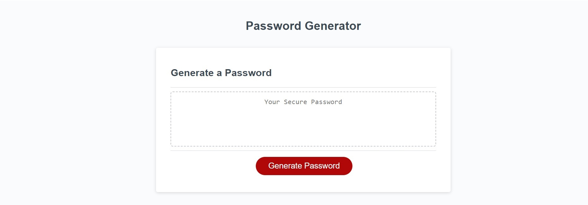
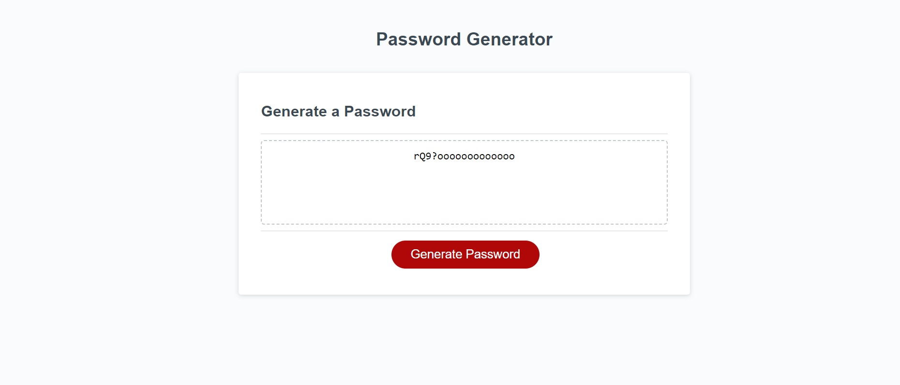

# Password-Generator
## Description
In this project I've created an algorithm to generate a random password.

The length of the password must be between 10 and 64 characters and th user need to choose at least one of the following options:
- Upper case.
- Lower case.
- Numbers.
- Special characters.

I have used diferents functions as well as diferents methods like Math.random, .push()., .join() as well as prompts and alerts.

## Usage

Application screenshot:

Application final result:

Deployed application link: https://antonioalgaba.github.io/Password-Generator/

## Credits

I used the following tutorials:

JavaScript function: https://www.w3schools.com/js/js_functions.asp

JavaScript methods: https://developer.mozilla.org/en-US/docs/Web/JavaScript/Reference
